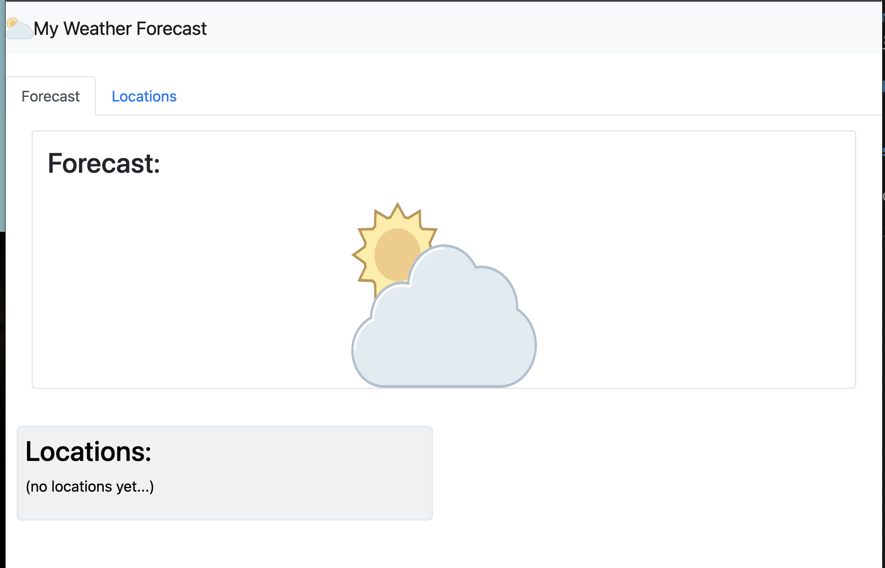
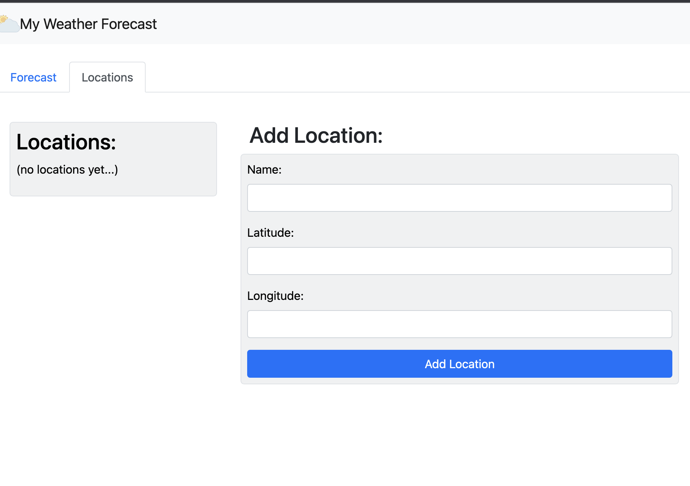
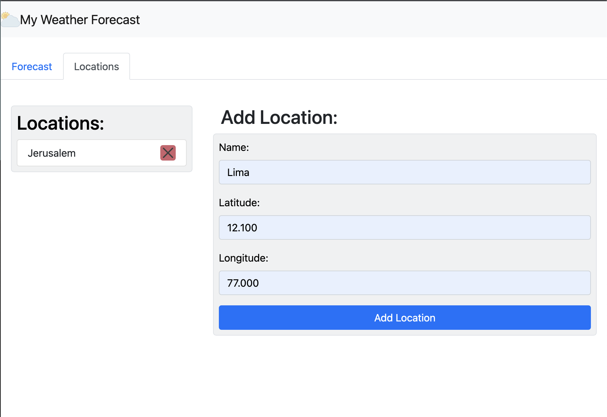
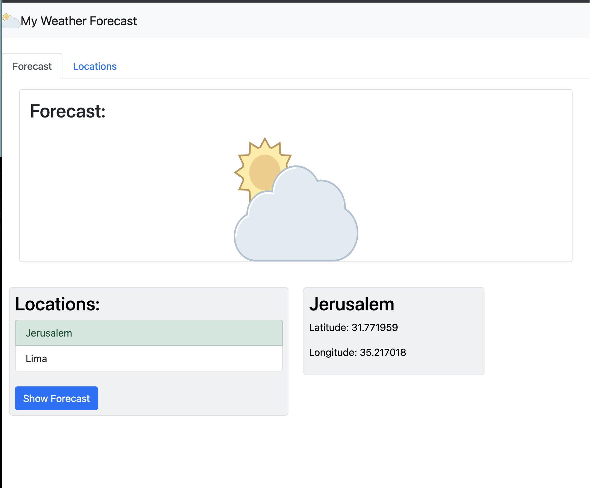
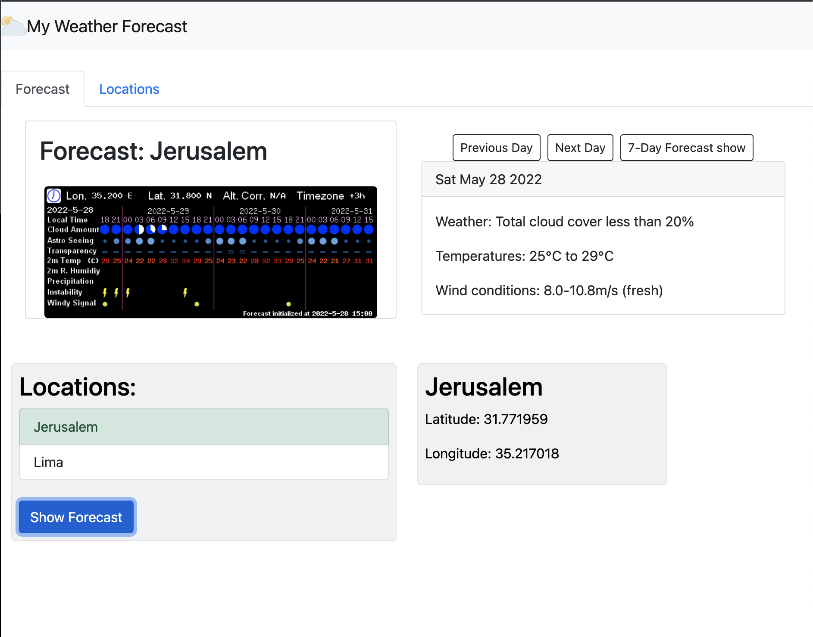
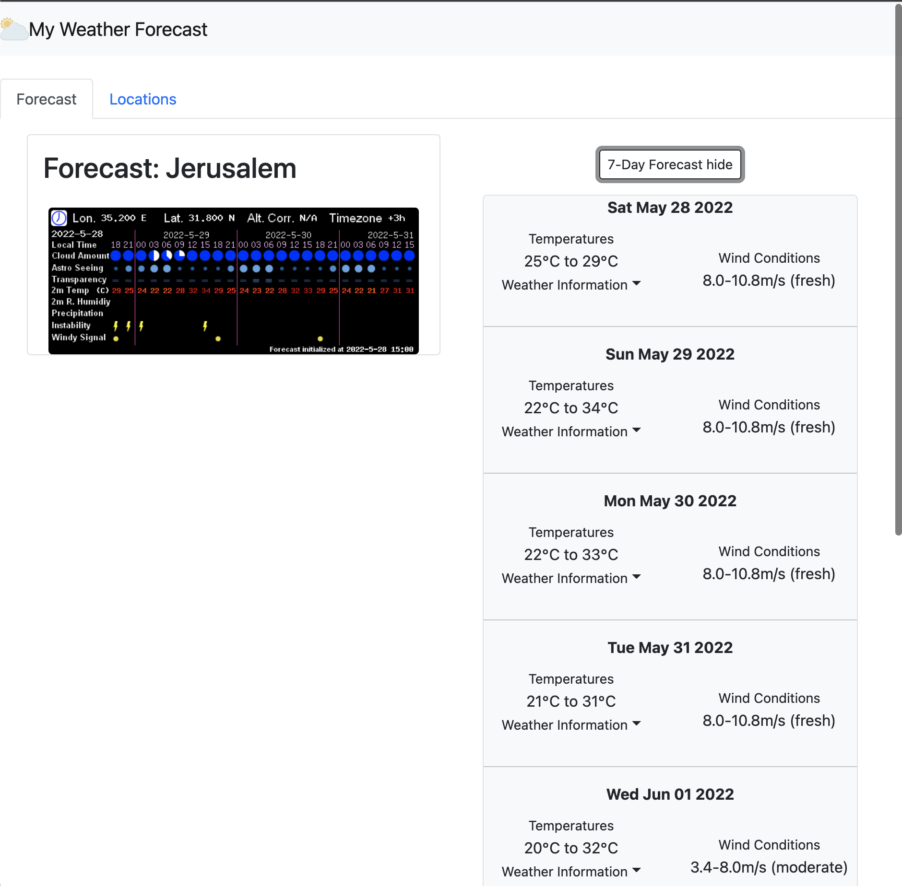

# React Forecast Weather

A simple application to display 7-day weather forecast using the
[7timer API](https://www.7timer.info).

## Demo
https://dmaman86.github.io/react-forecast-weather/

## Dependencies
    - React 18+

## Installation
```
Open console, execute: npm install
```

## App screenshots

 | 
:---: | :---:
 | 
 | 