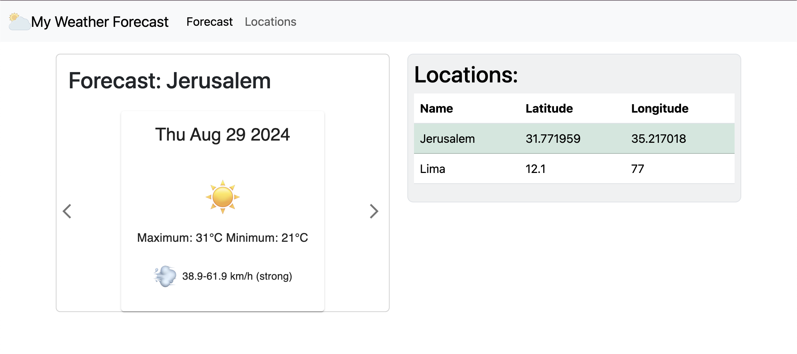

# React Forecast Weather

A simple application to display 7-day weather forecast using the
[7timer API](https://www.7timer.info).

## Demo
https://dmaman86.github.io/react-forecast-weather/

## Dependencies
This project is built with the following key libraries:

- **React 18+**: A JavaScript library for building user interfaces.
- **Bootstrap**: A popular CSS framework for developing responsive and mobile-first websites.
- **MUI (Material-UI)**: A React component library that implements Google's Material Design.
- **Axios**: A promise-based HTTP client for the browser and Node.js, used for making HTTP requests.

## Installation
To install the dependencies, run:
```bash
npm install
```

## Running the Application
After installation, execute:
```bash
npm run dev
```
This will start the development server, and you can view the application in your browser at http://localhost:5173/react-forecast-weather/.

## App screenshots

 | 
:---: | :---:
 | 


